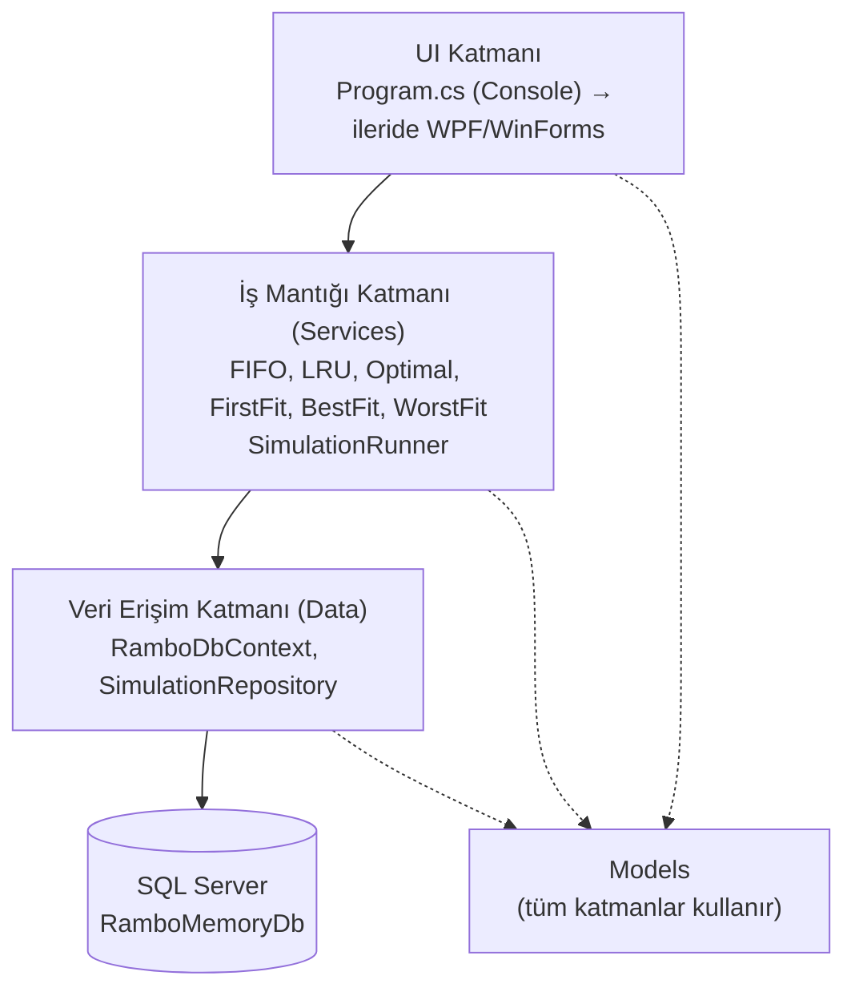
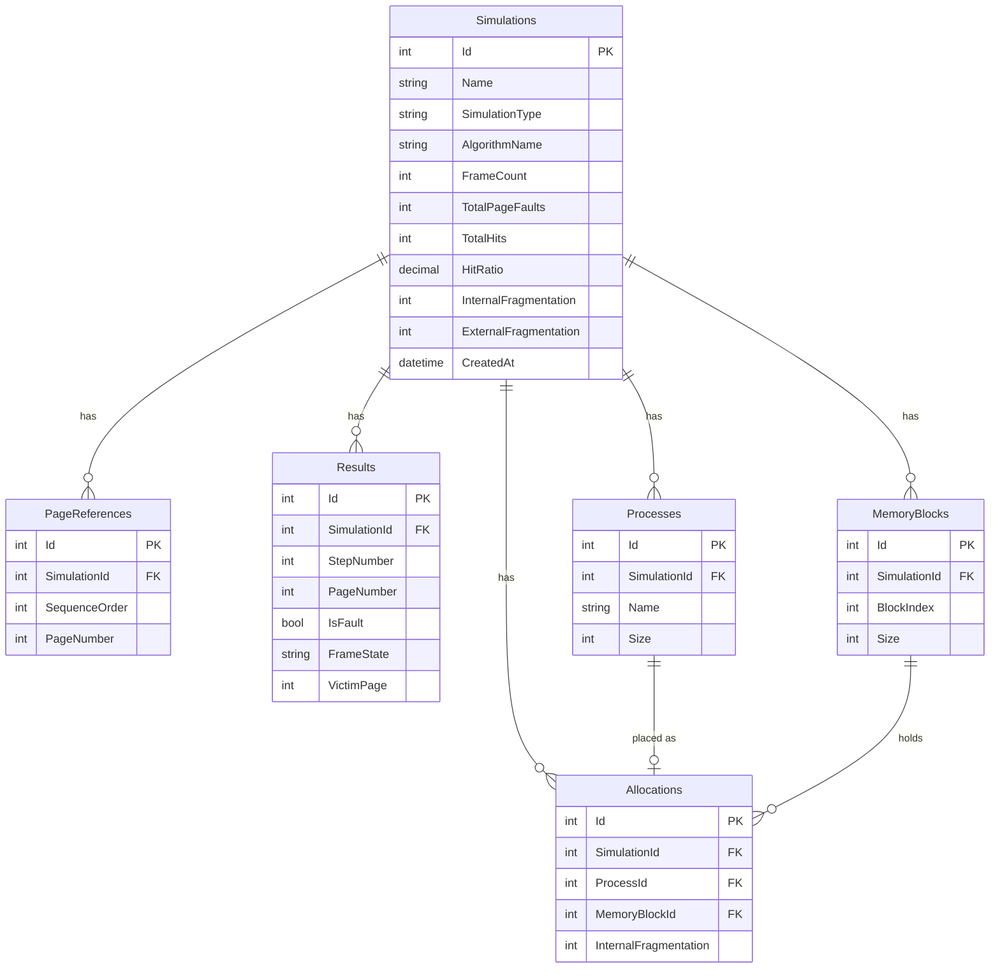

# RAMbo | Hafta 2: Mimari ve Veritabanı Tasarımı

COME 361 – Operating Systems | Chapter 9 – Memory Management

## 1. Katmanlı mimari

| Katman | Klasör | Sorumluluk |
|---|---|---|
| UI | `Program.cs` | Kullanıcıdan girdi alır, sonucu gösterir. Algoritma bilmez. |
| İş mantığı | `Services/` | Algoritmalar burada. Veritabanını bilmez, sadece model döner. |
| Veri erişimi | `Data/` | EF Core ile kaydet/oku. Algoritma bilmez. |
| Modeller | `Models/` | Düz veri sınıfları. |

**Kural:** Algoritmalar veritabanına doğrudan dokunmaz. Bu sayede herkes kendi algoritmasını bağımsız yazıp sonda birleştirebilir.

## 2. ER diyagramı

## 3. Tablo açıklamaları

- **Simulations:** Her çalıştırmanın özeti. `SimulationType` ile sayfa değiştirme ve bölümleme ayrılır, tek tablo iki konuya hizmet eder.
- **PageReferences / Results:** Sayfa değiştirme (Hafta 4-6) için referans dizisi ve adım adım frame durumu.
- **Processes / MemoryBlocks / Allocations:** Bölümleme (Hafta 7) için. `MemoryBlockId = NULL` olan satır, sürecin hiçbir bloğa sığmadığını gösterir (dış parçalanma analizi).

## 4. Görev dağılımı için sözleşme

Herkes `Services/Interfaces/` altındaki arayüzleri kullanır. `Models/` ve arayüzler değişecekse önce grupla konuşulur.
